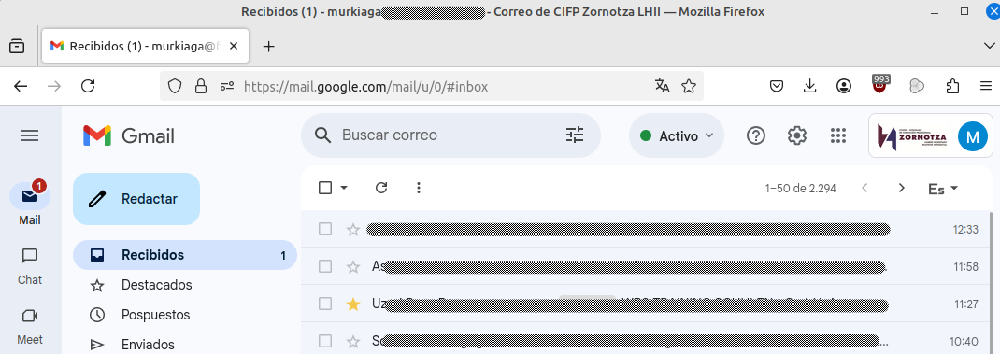
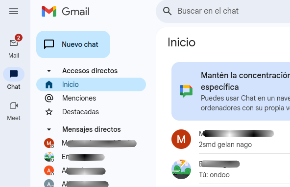

# 1. Bidalketa: Konprimiso Profesionala

## 1A bidalketa: Komunikazioa

Komunikazio kanalen artean 2 multzo bereizi ditut: Sinkronoak eta Asinkronoak

- **Sinkronoak**:

    - Aurrez aurreko bilerak:
        
    Bilerak beharrezkoak direnean soilik egin behar dira. Mintegi mailako erabakiak direnean guztiok batzea zentzuzkoa da. Ikasleen ebaluazio garaietan ere irakasle taldea batzen gara.

    - Elkarrizketak:

    Gauzatxo batzuk azkar argitu daitezkenak, koordinazio momentu batzuk, jarraipen azkarra egiteko, ... ordu eta data bat jarri gabe, zuzenean ikastetxean alkar topatzean sortutako elkarrizketak.

    - Telefono deiak:

    Beharrezkoak direnean soilik. Beste kanalen bat erabiltzerik badago, hobe da bestea erabiltzea. Hauek urgentzia uneetan soilik erabili.

    - Bideodeiak google meet erabiliz

    Pertsonan batu ezin den uneetan erabiltzen da. Komunikazio sinkronoa behar denean baina fisikoki elkartu ezin denean bideodeiak egitea komunikazio kanal egokia izan daiteke.

- **Asinkronoak**
    - Emaila:

    Erabakiak, aktak, data konkretuak... idatzita gera daitezen, inorek ezulerturik izan ez dezan.

    Ingurune profesionaletan erabiliena den kanala da emaila, ez du berealakotasunik eskatzen baina esan beharrekoa idatziz geratzen da.
    Gainera, mezuek aukera ematen dute hartzaile askori bidaltzeko aukera.
    

    - Gmaileko Chata:

    Aurrez-aurreko elkarrizketen parera, irakasleen arteko komunikazio arinerako kanala da hau. Kontsulta azkar batzuk egiteko adibidez.
    

    - WhatsApp taldea:

    Mintegi mailan zabaldu behar diren berriak zabaltzeko, mezu elektronikoaren "seriotasunera" jo gabe, edo lankide batzuei zerbait gogoratzeko (adib: "gogoratu 10 minutu barru bilera daukagula") 
