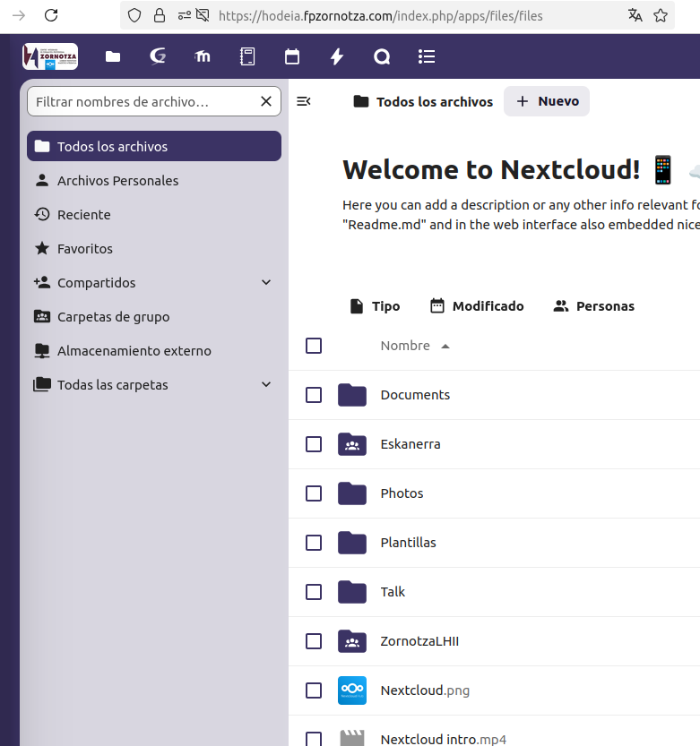
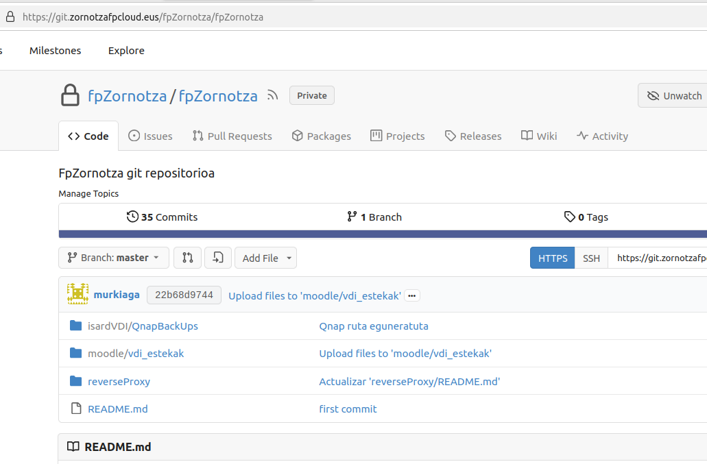
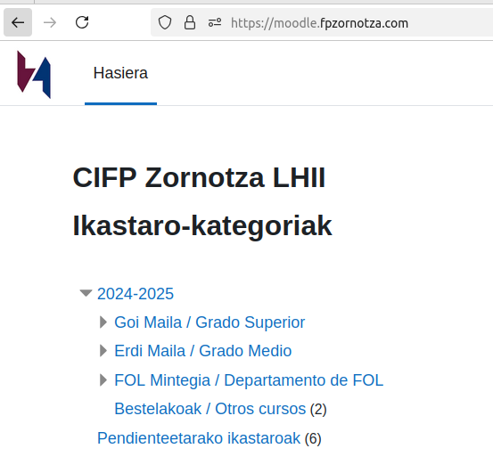

# 1. Bidalketa: Konprimiso Profesionala

## 1B bidalketa: Elkarlana

- Irakasle taldeari dagokionez

Partekatu nahi ditugn edukiak **NextCloud** eta **Drivean** gordetzen ditugu. Tresna hauek aukera ematen digute besteekin dokumentuak partekatzeko edota elkarlanean dokumentuak osatzen joateko. Adibidez, Ethazi zikloetan ikasleen jarraipen bateratua egiteko, irakasle talde guztiak kalkulu orri bakarra betetzen dugu eta beraz, badakigu gainontzeko irakasleek zer jarraipen egin duten.

Drive oso tresna potentea da baina Googleren menpe gaude berriro. Horregatik erabaki zen NextCloud bezalako tresna bat instalatzea gure zerbitzarietan eta edukiak bertara pasatzea. Honen abantailetako bat, LDAP bidezko logina ahalbideratzen duela eta beraz, gure domeinuko irakasle talde guztiak kontu bat badutela jada. Baina gaur egun oraindik bi tresnak erabiltzen jarraitzen dugu.

Dokumentuak zerbitzari batean gordeta izateak **interneteko konexioaren beharra** dakar.

**Git** propioa ere erabiltzen dugu ikastetxeko kudeaketarako kode eta dokumentazioa partekatzeko, informatika administrarien artean. Honen abantaila nagusia egindakoa dokumentatuta geratzen dela, hurrengo beste norbaitek egindako hori "nola" egin den ikusi al izateko.

- Modulu profesionalei dagokienez

**Moodle** erabiltzen dugu e-learning plataforma gisa. Han jartzen ditugu gure modulu profesionalen edukiak ikasleek atzigarri izan ditzaten. Horretaz gain, **irakasleon elkarlanerako tresna bat ere bada**, zeren eta beste modulu profesional batzuetako edukiak ere ikus ditzakegu edo aurreko urteko ikastaroa kontsultatu dezakegu zer ariketa egin ziren ikusteko. Gainera, modulu berdina euskaraz eta erdaraz ematen denean, irakasleak sortutako edukiak partekatu ditzakete (galdera bankua erabiliz adibidez).

