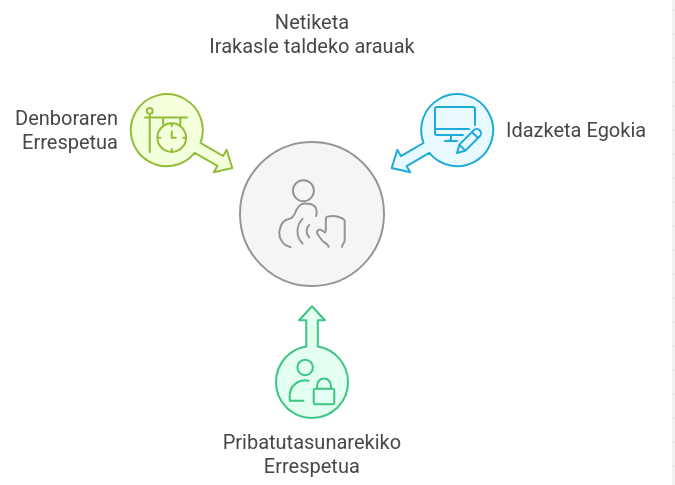

# 1. Bidalketa: Konprimiso Profesionala

## 1C bidalketa: Netiketa

- **Modu egokian idatzi**

    - Argitasuna: Idazteko orduan, argi eta labur izan behar dugu. Ideiak ondo antolatuta aurkeztu behar dira, irakurleak ulertzeko erraza izan dadin.

    - Gramatika eta ortografia: Idazteko orduan, gramatika eta ortografia zaindu behar dira. Horrela, profesionaltasuna eta errespetua adierazten dira.

    - Tono egokia: Testuinguruaren arabera, tonu egokia hautatu behar da. Adibidez, lagunarteko elkarrizketetan tonu informalagoa erabil daiteke, baina laneko komunikazioan tonu serioagoa izan behar da.

- **Elkarrekiko pribatutasuna**

    - Informazio pertsonala: Ez partekatu informazio pertsonalik, hala nola helbideak, telefono zenbakiak edo banku datuak, publikoan. (adib: *emailetan bcc erabili*)

    - Beste pertsonen pribatutasuna: Beste pertsonen iritziak edo informazioa partekatu aurretik, beti eskatu baimena. Horrela, elkarrekiko errespetua mantentzen da.

 - **Denboraren errespetua**

    - Besteen denbora errespetatu: Online bilera edo elkarrizketetan, beste pertsonen denbora errespetatu behar da. Ez da onargarria denbora asko hartzea edo gaia aldatzea. Horretarako, bilera aurretik argi zehaztu zein diren bileraren helburuak, bilerak beharrezkoak direnean soilik egitea eta une egokian.
